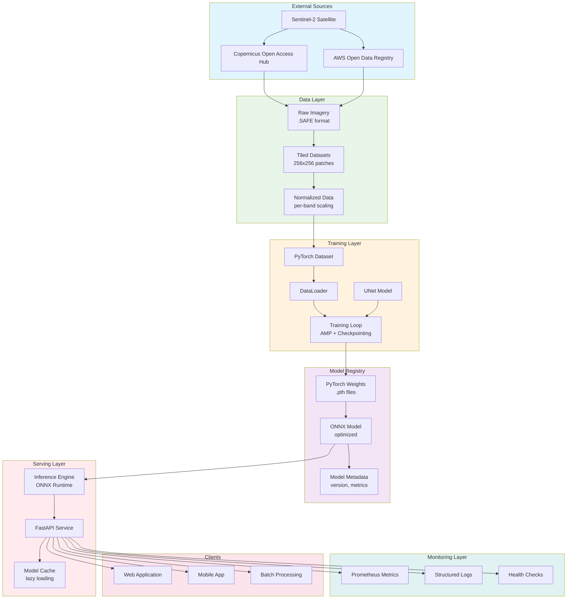
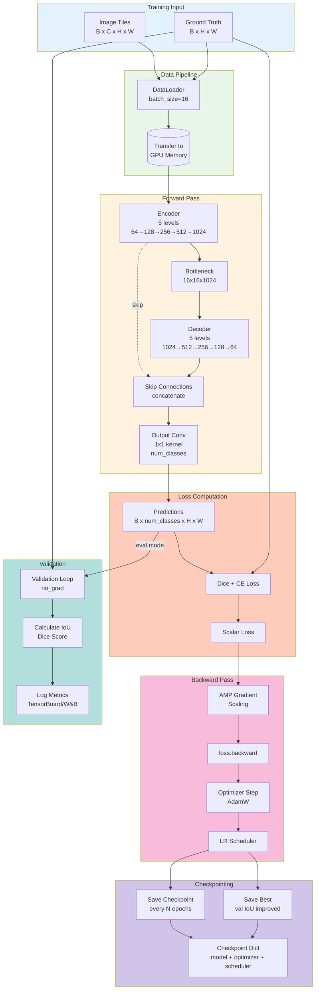
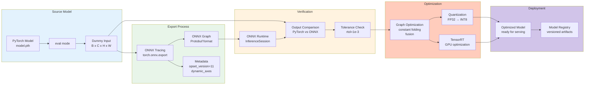
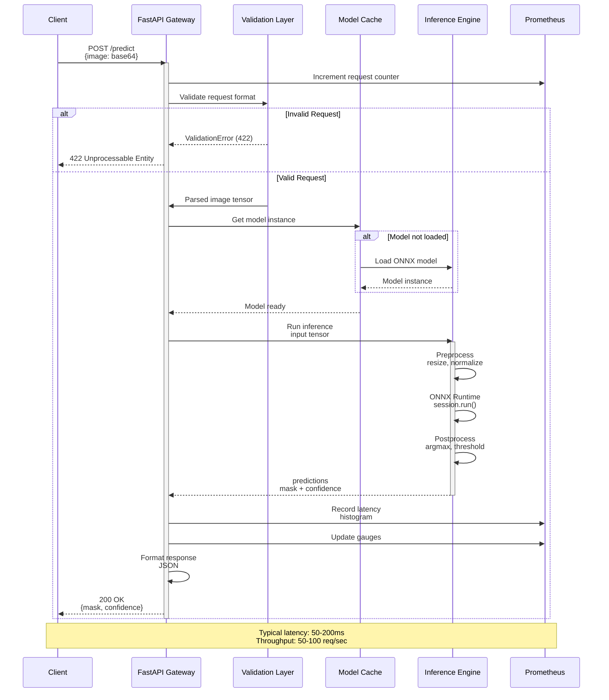
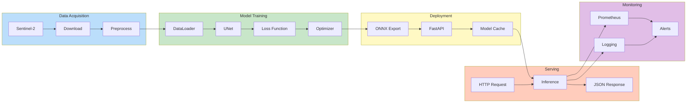

## Architecture

This document describes the data flow architecture for the Remote Sensing ML pipeline. All diagrams use Mermaid to visualize how data moves through the system.

---

## High-Level System Architecture

---

## Data Ingestion Flow

```mermaid
flowchart LR
    subgraph Source["Data Source"]
        S2[Sentinel-2 Scene<br/>10000x10000px<br/>13 bands]
    end
    
    subgraph Download["Download"]
        SAFE[.SAFE Container<br/>JP2 format]
        BAND[Individual Bands<br/>B2-B12]
    end
    
    subgraph Preprocess["Preprocessing"]
        READ[Read with Rasterio<br/>numpy arrays]
        STACK[Stack Bands<br/>H x W x C]
        TILE[Tiling<br/>256x256 patches]
        NORM[Normalization<br/>per-band scaling]
    end
    
    subgraph Storage["Storage"]
        RAW[Raw Tiles<br/>float32]
        MASK[Ground Truth Masks<br/>uint8]
        META[Metadata JSON<br/>geospatial info]
    end
    
    subgraph Consumption["Consumption"]
        DS[Dataset Class<br/>__getitem__]
        AUG[Augmentation<br/>flip, rotate, noise]
        TENSOR[PyTorch Tensor<br/>B x C x H x W]
    end
    
    S2 -->|ESA API| SAFE
    SAFE -->|Extract| BAND
    BAND --> READ
    READ --> STACK
    STACK -->|Sliding Window| TILE
    TILE -->|z-score or min-max| NORM
    NORM --> RAW
    NORM --> MASK
    RAW --> META
    RAW --> DS
    MASK --> DS
    META --> DS
    DS -->|On-the-fly| AUG
    AUG --> TENSOR
    
    style Source fill:#e3f2fd
    style Download fill:#e8f5e9
    style Preprocess fill:#fff3e0
    style Storage fill:#f3e5f5
    style Consumption fill:#ffebee
```

**Key Data Transformations**:
- **JP2 → numpy**: Lossless decompression
- **H x W x C → C x H x W**: Channel-first for PyTorch
- **uint16 → float32**: Normalization requires float
- **256x256 patches**: Memory-efficient training

---

## Training Pipeline Flow

**Data Flow Details**:
- **Batch size**: 16-32 depending on GPU memory
- **AMP**: Automatic Mixed Precision (FP16) for 2x speedup
- **Gradient accumulation**: For larger effective batch size
- **Checkpoint frequency**: Every epoch + when validation improves

---

## Model Export & Optimization Flow

**Export Details**:
- **Dynamic axes**: Allow variable batch sizes
- **Opset version**: 11 for good compatibility
- **Verification**: Numerical tolerance 1e-3 acceptable
- **Optimization**: ~1.5-3x speedup, 4x smaller with quantization

---

## Inference API Flow

**Request Flow**:
1. Client sends HTTP POST with image
2. API validates format and size
3. Model loaded once (lazy initialization)
4. Preprocessing (resize to 256x256, normalize)
5. ONNX Runtime inference
6. Postprocessing (argmax, confidence scores)
7. Metrics recorded
8. JSON response returned

---

## End-to-End Data Flow Summary

**Summary**:
1. **Data**: Satellite → Preprocessed tiles
2. **Train**: UNet trained with AMP + checkpointing
3. **Deploy**: Export to ONNX, serve with FastAPI
4. **Serve**: REST API for real-time predictions
5. **Monitor**: Metrics, logs, and alerting

---

## Notes

- All diagrams are interactive and can be viewed with Mermaid-supported viewers
- Data flows are designed to be modular and replaceable
- Each stage has clear inputs and outputs for testing
- Monitoring is integrated at every layer for observability
