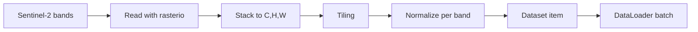

# Module 01: Data Pipeline - Satellite to Tiles

Timebox: 2 pomodoros (50 min)

## Goals
- Explain Sentinel-2 bands and what each band is useful for
- Describe why tiling is necessary and how tile size affects training
- Outline a clean Dataset flow from raw files to tensors
- Choose and justify a normalization strategy

## Visual map

## Timeline and checklist

```mermaid
gantt
	title Module 01 Timeline (50 min)
	dateFormat  HH:mm
	axisFormat  %H:%M
	section Study
	Warmup and goals     :a1, 00:00, 05m
	Core concepts        :a2, 00:05, 15m
	Guided practice      :a3, 00:20, 20m
	Pitfalls and recap   :a4, 00:40, 05m
	Quick test review    :a5, 00:45, 05m
```

- [ ] Warmup and goals
- [ ] Core concepts
- [ ] Guided practice
- [ ] Pitfalls and recap
- [ ] Quick test review

## Concepts to explain out loud
- Sentinel-2 bands (B2, B3, B4, B8, B11, B12) and which ones matter for burn detection
- Spatial vs spectral resolution
- Tiling tradeoffs: context vs batch size vs memory
- Dataset statistics vs per-image normalization
- Shapes: rasterio returns (bands, height, width); PyTorch expects (channels, height, width)

## Tutor prompts (no code)
- Walk me through a single sample from disk to model input.
- How do you guarantee band order is correct?
- What are the failure modes if you normalize per-image at training time?
- How would you handle tiles at image edges?

## Pseudocode sketch (minimal)
- Map band names to file paths in a deterministic order.
- Read bands into arrays using windowed reads.
- Stack to (C, H, W) and convert to float32.
- Tile with fixed size and stride or random crops.
- Normalize using precomputed mean and std per band.
- Return tensor image and mask from Dataset item.

## Checkpoints
- A single tile has shape (C, H, W) with consistent band order.
- Normalization produces stable value ranges with no NaN or Inf.
- Dataset length matches expected number of tiles.

## Common pitfalls
- Mixing RGB order with Sentinel-2 band order
- Converting to float after normalization (loss of precision)
- Loading full scenes into memory instead of tiled reads
- Forgetting to copy arrays before normalization

## Interview focus
- Explain why SWIR bands highlight burned areas.
- Describe how you would validate the data pipeline quickly.

## Test
- pytest tests/test_module_01_data.py -v

## Further reading
- Sentinel-2 user guide
- Rasterio docs
- PyTorch data loading tutorial
