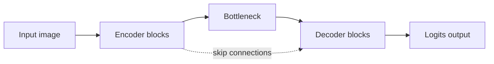

# Module 02: UNet Architecture - Encoder-Decoder Design

Timebox: 2 pomodoros (50 min)

## Goals
- Describe the UNet encoder, bottleneck, and decoder
- Explain why skip connections matter for segmentation
- Track shapes and channels across the network
- Explain why the final layer outputs logits

## Visual map

## Timeline and checklist

```mermaid
gantt
	title Module 02 Timeline (50 min)
	dateFormat  HH:mm
	axisFormat  %H:%M
	section Study
	Warmup and goals     :a1, 00:00, 05m
	Core concepts        :a2, 00:05, 15m
	Guided practice      :a3, 00:20, 20m
	Pitfalls and recap   :a4, 00:40, 05m
	Quick test review    :a5, 00:45, 05m
```

- [ ] Warmup and goals
- [ ] Core concepts
- [ ] Guided practice
- [ ] Pitfalls and recap
- [ ] Quick test review

## Concepts to explain out loud
- Encoder reduces spatial size while increasing channels
- Decoder restores spatial size using upsampling
- Skip connections preserve fine detail
- Output is per-pixel class logits

## Tutor prompts (no code)
- If input is 256x256, what are the spatial sizes at each level?
- Why do we concatenate features instead of adding them?
- What happens if you remove skip connections?
- Why do we avoid sigmoid or softmax inside the model?

## Pseudocode sketch (minimal)
- Build a repeated block: conv -> norm -> relu (twice).
- Encoder path: block then downsample, keep each block output for skips.
- Bottleneck: deepest block.
- Decoder path: upsample, concatenate skip, then block.
- Final 1x1 conv to num_classes.

## Checkpoints
- Output spatial size matches input spatial size.
- Channels at each stage match the plan.
- Forward pass runs without shape mismatch.

## Common pitfalls
- Concatenating along the wrong dimension
- Size mismatch when concatenating skip features
- Using an activation in the model instead of in the loss
- Too many levels for small input sizes

## Interview focus
- Draw the UNet on a whiteboard with shapes.
- Explain the tradeoff between depth and memory.

## Test
- pytest tests/test_module_02_unet.py -v

## Further reading
- U-Net paper (Ronneberger et al., 2015)
- Distill article on transposed conv artifacts
