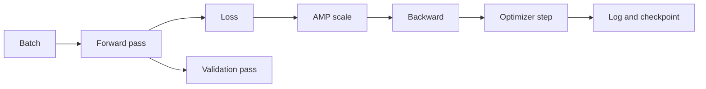

# Module 03: Training Loop - AMP and Checkpointing

Timebox: 2 pomodoros (50 min)

## Goals
- Outline a robust training and validation loop
- Explain AMP and why it speeds up training
- Describe what to save in checkpoints and why
- Define logging signals that matter

## Visual map

## Timeline and checklist

```mermaid
gantt
  title Module 03 Timeline (50 min)
  dateFormat  HH:mm
  axisFormat  %H:%M
  section Study
  Warmup and goals     :a1, 00:00, 05m
  Core concepts        :a2, 00:05, 15m
  Guided practice      :a3, 00:20, 20m
  Pitfalls and recap   :a4, 00:40, 05m
  Quick test review    :a5, 00:45, 05m
```

- [ ] Warmup and goals
- [ ] Core concepts
- [ ] Guided practice
- [ ] Pitfalls and recap
- [ ] Quick test review

## Concepts to explain out loud
- Train vs eval modes and why they differ
- AMP: mixed precision with loss scaling
- Validation timing and why it is per-epoch
- Checkpoint contents: model, optimizer, scheduler, scaler, epoch

## Tutor prompts (no code)
- What do you log every epoch, and why?
- How do you know if the learning rate is too high?
- How do you resume training safely after a crash?

## Pseudocode sketch (minimal)
- For each epoch:
  - Train: set train mode, run batches, compute loss, scale and step.
  - Validate: set eval mode, no grad, compute metrics.
  - Log averaged metrics and learning rate.
  - Save latest and best checkpoints.

## Checkpoints
- Training loss trends down on a small sample.
- Validation metrics are computed without gradient tracking.
- Checkpoints allow resume from the exact epoch.

## Common pitfalls
- Forgetting zero_grad
- Mixing train and eval modes
- Skipping scaler update in AMP
- Logging every batch instead of averaged intervals

## Interview focus
- Explain why Dice is useful for imbalanced segmentation.
- Describe a quick sanity check to verify the loop.

## Test
- pytest tests/test_module_03_training.py -v

## Further reading
- PyTorch AMP recipe
- AdamW vs Adam explanation
