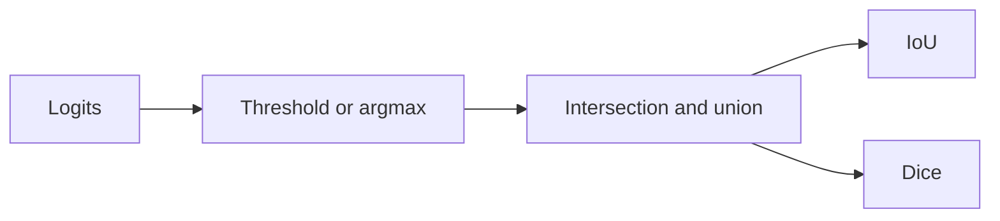

# Module 04: Evaluation Metrics - IoU and Dice

Timebox: 1 pomodoro (25 min)

## Goals
- Define IoU and Dice and explain when to use them
- Handle edge cases like empty masks
- Explain per-class and mean metrics

## Visual map

## Timeline and checklist

```mermaid
gantt
	title Module 04 Timeline (25 min)
	dateFormat  HH:mm
	axisFormat  %H:%M
	section Study
	Warmup and goals     :a1, 00:00, 03m
	Core concepts        :a2, 00:03, 08m
	Guided practice      :a3, 00:11, 10m
	Pitfalls and recap   :a4, 00:21, 02m
	Quick test review    :a5, 00:23, 02m
```

- [ ] Warmup and goals
- [ ] Core concepts
- [ ] Guided practice
- [ ] Pitfalls and recap
- [ ] Quick test review

## Concepts to explain out loud
- Accuracy is misleading with class imbalance
- IoU = intersection / union
- Dice = 2 * intersection / (pred + true)
- Relationship between IoU and Dice
- Smoothing to avoid divide-by-zero

## Tutor prompts (no code)
- When is mIoU more informative than frequency-weighted IoU?
- Why do we threshold logits before metrics?
- What does a Dice score of 0.75 mean in practice?

## Pseudocode sketch (minimal)
- Convert logits to class predictions.
- Compute intersection and union.
- Apply smoothing for empty masks.
- Average per-class metrics if needed.

## Checkpoints
- Metrics return 1.0 for perfect overlap.
- Empty masks do not return NaN.
- Multi-class metrics average correctly.

## Common pitfalls
- Comparing logits directly to ground truth
- Using integer division by accident
- Mixing batch and class dimensions

## Interview focus
- Explain the mathematical difference between IoU and Dice.
- Describe how you would validate a metric implementation.

## Test
- pytest tests/test_module_04_metrics.py -v

## Further reading
- IoU vs Dice in segmentation surveys
- TensorFlow MeanIoU docs
