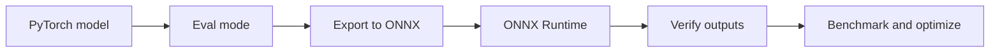

# Module 05: ONNX Export and Optimization

Timebox: 1 pomodoro (25 min)

## Goals
- Explain why we export models to ONNX
- Outline the export and verification steps
- Describe ONNX Runtime performance options

## Visual map

## Timeline and checklist

```mermaid
gantt
	title Module 05 Timeline (25 min)
	dateFormat  HH:mm
	axisFormat  %H:%M
	section Study
	Warmup and goals     :a1, 00:00, 03m
	Core concepts        :a2, 00:03, 08m
	Guided practice      :a3, 00:11, 10m
	Pitfalls and recap   :a4, 00:21, 02m
	Quick test review    :a5, 00:23, 02m
```

- [ ] Warmup and goals
- [ ] Core concepts
- [ ] Guided practice
- [ ] Pitfalls and recap
- [ ] Quick test review

## Concepts to explain out loud
- Training vs deployment environments
- ONNX as a framework-agnostic graph format
- Verification: comparing ONNX outputs to PyTorch
- Dynamic axes for flexible batch sizes
- Quantization tradeoffs

## Tutor prompts (no code)
- What can go wrong when exporting to ONNX?
- Why is model.eval important during export?
- How would you prove ONNX correctness?

## Pseudocode sketch (minimal)
- Load checkpoint and set model to eval.
- Create a dummy input with the expected shape.
- Export to ONNX with input and output names.
- Run ONNX inference and compare outputs within tolerance.
- Benchmark ONNX vs PyTorch inference speed.

## Checkpoints
- ONNX file is created and loads in runtime.
- Outputs match within a small tolerance.
- Batch size can be varied if dynamic axes are set.

## Common pitfalls
- Exporting in train mode
- Using the wrong input shape
- Using overly strict output comparisons
- Forgetting to move to CPU for export

## Interview focus
- Explain when ONNX is the right choice vs TorchScript.
- Describe how quantization changes speed and accuracy.

## Test
- pytest tests/test_module_05_onnx.py -v

## Further reading
- ONNX Runtime docs
- PyTorch ONNX export guide
