# Module 06: FastAPI Deployment - REST API

Timebox: 2 pomodoros (50 min)

## Goals
- Describe a clean API design for segmentation inference
- Explain request validation with Pydantic
- Distinguish async vs sync endpoints
- Explain safe model loading patterns

## Visual map

## Timeline and checklist

```mermaid
gantt
	title Module 06 Timeline (50 min)
	dateFormat  HH:mm
	axisFormat  %H:%M
	section Study
	Warmup and goals     :a1, 00:00, 05m
	Core concepts        :a2, 00:05, 15m
	Guided practice      :a3, 00:20, 20m
	Pitfalls and recap   :a4, 00:40, 05m
	Quick test review    :a5, 00:45, 05m
```

- [ ] Warmup and goals
- [ ] Core concepts
- [ ] Guided practice
- [ ] Pitfalls and recap
- [ ] Quick test review

## Concepts to explain out loud
- REST endpoints for health, predict, and metadata
- Uploads vs base64 payloads
- Validation and error handling
- Lazy model loading and caching
## Tutor prompts (no code)
- What should /health return and why?
- How do you handle very large images safely?
- When do you choose async endpoints?

## Pseudocode sketch (minimal)
- Create app and request/response models.
- Add /health endpoint.
- Add /predict endpoint that loads model, preprocesses, runs inference.
- Return a structured response with timings and shapes.

## Checkpoints
- Requests are validated before inference.
- Errors return clear HTTP status codes.
- Model loads once and is reused.

## Common pitfalls
- Loading the model at import time
- Blocking async endpoints with heavy CPU work
- Not validating image content type or size

## Interview focus
- Explain how you would version the API.
- Describe how to add batch prediction safely.

## Test
- pytest tests/test_module_06_api.py -v

## Further reading
- FastAPI tutorial
- Pydantic docs
