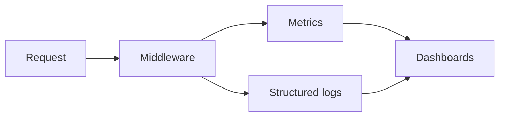

# Module 07: Monitoring and Observability

Timebox: 1 pomodoro (25 min)

## Goals
- Add basic Prometheus metrics to the API
- Explain the difference between logs, metrics, and traces
- Define health checks for liveness and readiness

## Visual map

## Timeline and checklist

```mermaid
gantt
	title Module 07 Timeline (25 min)
	dateFormat  HH:mm
	axisFormat  %H:%M
	section Study
	Warmup and goals     :a1, 00:00, 03m
	Core concepts        :a2, 00:03, 08m
	Guided practice      :a3, 00:11, 10m
	Pitfalls and recap   :a4, 00:21, 02m
	Quick test review    :a5, 00:23, 02m
```

- [ ] Warmup and goals
- [ ] Core concepts
- [ ] Guided practice
- [ ] Pitfalls and recap
- [ ] Quick test review

## Concepts to explain out loud
- Counters, gauges, histograms, summaries
- Request latency percentiles
- Structured logging and why it matters
- Liveness vs readiness
## Tutor prompts (no code)
- Which metrics would you alert on first?
- How do you avoid metric label explosion?
- How do you monitor model quality without labels?

## Pseudocode sketch (minimal)
- Create metrics (request count, latency histogram).
- Add middleware to measure requests.
- Add /metrics endpoint.
- Add structured logging for key events.
- Add /health/live and /health/ready endpoints.

## Checkpoints
- Metrics endpoint returns Prometheus format.
- Request count increases after calls.
- Logs include consistent fields.

## Common pitfalls
- Too many labels in metrics
- Logging sensitive data
- No error handling in middleware

## Interview focus
- Explain what you would monitor for data drift.
- Describe how you would set alert thresholds.

## Test
- pytest tests/test_module_07_monitoring.py -v

## Further reading
- Prometheus best practices
- Google SRE monitoring chapter
